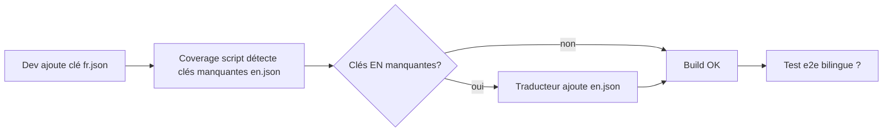

# I18N-1 phase 0 — Cadrage internationalisation IOX

**Statut** : draft cadrage, doc only, zéro code.
**Date** : 2026-04-30.
**Sortie** : ce document + handoff vers I18N-1 phase 1 (POC `next-intl` sur 1 page).

---

## 1. Objectifs

Étendre IOX au-delà du français pour ouvrir le marketplace aux buyers
internationaux. V1 : **FR + EN**. V2 : ajouts ciblés selon traction
(EN-only V1 couvre déjà 95% besoins acheteurs hors francophonie).

### 1.1 Pages concernées

| Zone | Pages | Priorité V1 |
|------|-------|-------------|
| Public marketplace (catalog) | `/marketplace`, `/marketplace/sellers/[slug]`, `/marketplace/products/[slug]`, `/marketplace/offers/[id]` | **🔥 critique** |
| Auth | `/login`, `/register`, `/unsubscribe` | **🔥 critique** |
| Buyer dashboard | `/buyer`, `/buyer/quote-requests`, `/buyer/quote-requests/[id]`, `/buyer/profile` | haute |
| Seller dashboard | `/seller/dashboard`, `/seller/marketplace-products`, `/seller/marketplace-offers`, `/seller/profile`, `/seller/documents` | moyenne (sellers FR-only OK V1) |
| Admin | `/admin/*` | nulle (staff IOX FR uniquement) |

### 1.2 Périmètre i18n

Quatre couches à internationaliser :
1. **UI labels** (boutons, titres, messages d'erreur, empty states) — V1.
2. **Données métier** (titres offres/produits saisis par seller) — multi-lingue partiel V2 (champ `titleEn` optionnel).
3. **Emails transactionnels** (templates rfq-*) — V1 langue choisie au moment de l'envoi (locale destinataire).
4. **Documents PDF** (factures, rapports) — V2.

### 1.3 Critère succès phase 1

- Toggle FR↔EN sur `/marketplace` fonctionnel (1 page POC).
- Architecture validée : namespace clés, fallback FR, build performant.

---

## 2. Stack technique

### 2.1 Frontend (Next.js App Router)

Trois bibliothèques candidates :

| Lib | Pour | Contre | Verdict |
|-----|------|--------|---------|
| **`next-intl`** | first-class App Router, server components OK, routing locale-prefix optionnel, ICU MessageFormat | dépendance externe | ✅ **reco** |
| `next-i18next` | populaire, doc abondante | conçu Pages Router, App Router support partiel | ❌ |
| Custom (Context + JSON) | contrôle total | réinvente roue, pas d'ICU, fastidieux | ❌ |

Reco : **`next-intl`** (≥ v3.x avec App Router, server components, routing).

### 2.2 Backend (NestJS)

Backend i18n moins critique :
- API REST renvoie codes d'erreur (ex `RFQ_INVALID_TRANSITION`), pas messages traduits.
- Le frontend mappe code → message localisé.
- Exception : emails transactionnels → templates par locale (`rfq-qualified.fr.template.ts`,
  `rfq-qualified.en.template.ts`).

Pas de `nestjs-i18n` requis. Logique : backend = source de vérité métier
(codes), frontend = couche présentation (traductions).

### 2.3 Routing

Trois options :

| Stratégie | URL | Pour | Contre |
|-----------|-----|------|--------|
| **Prefix optionnel** (`next-intl` default) | `/marketplace` (FR), `/en/marketplace` | bonne UX FR, SEO multi-locale | redirect si locale inconnue |
| Prefix obligatoire | `/fr/marketplace`, `/en/marketplace` | strict | rupture URL existantes |
| Cookie + sub-domain | `marketplace.iox.mch` (FR), `en.marketplace.iox.mch` | SEO max | infra complexe |

Reco V1 : **prefix optionnel** (FR par défaut sans prefix, EN avec `/en` prefix). Compatible URLs existantes.

### 2.4 Détection locale

Ordre de priorité :
1. URL prefix (si présent)
2. Cookie `NEXT_LOCALE`
3. Header `Accept-Language` du navigateur
4. Default `fr`

---

## 3. Architecture des fichiers traductions

### 3.1 Structure

```
apps/frontend/
  messages/
    fr.json           # source de vérité, complet
    en.json           # traduction, peut avoir clés manquantes (fallback fr)
  src/
    i18n/
      config.ts       # locales = ['fr', 'en'], defaultLocale = 'fr'
      request.ts      # next-intl request config (server)
      navigation.ts   # Link, useRouter, redirect (typés locales)
```

### 3.2 Convention de clés

**Namespace par feature** :
```json
{
  "common": {
    "actions": { "save": "Enregistrer", "cancel": "Annuler", "delete": "Supprimer" },
    "states": { "loading": "Chargement…", "empty": "Aucun résultat" }
  },
  "auth": {
    "login": { "title": "Connexion", "submit": "Se connecter" }
  },
  "marketplace": {
    "catalog": { "title": "Catalogue", "filters": { "category": "Catégorie" } },
    "rfq": {
      "status": { "NEW": "Nouvelle", "QUALIFIED": "Qualifiée", ... }
    }
  },
  "buyer": {
    "dashboard": { "title": "Bonjour {firstName}" },
    "quoteRequests": { "list": { ... } }
  }
}
```

### 3.3 Pluralisation

ICU MessageFormat (supporté par `next-intl`) :

```json
{
  "buyer": {
    "rfqCount": "{count, plural, =0 {Aucune demande} one {1 demande} other {# demandes}}"
  }
}
```

Usage :
```tsx
const t = useTranslations('buyer');
return <p>{t('rfqCount', { count: 5 })}</p>; // "5 demandes"
```

### 3.4 Interpolation

```json
{
  "auth": {
    "welcome": "Bienvenue, {firstName} !"
  }
}
```

```tsx
t('welcome', { firstName: user.firstName })
```

### 3.5 Dates et nombres

`next-intl` expose `useFormatter()` pour formatages locaux :

```tsx
const format = useFormatter();
format.dateTime(new Date(), { dateStyle: 'medium' });  // "30 avr. 2026" (fr) / "Apr 30, 2026" (en)
format.number(1234.56, { style: 'currency', currency: 'EUR' });  // "1 234,56 €" / "€1,234.56"
```

---

## 4. Workflow de traduction

### 4.1 Pipeline



### 4.2 Scripts ajoutés

`apps/frontend/scripts/i18n-coverage.ts` :
- Compare `fr.json` (référence) vs `en.json`
- Émet warning sur stdout pour chaque clé manquante en EN
- Fail CI si `--strict` (option phase 2+)

`pnpm i18n:check` → exécute le script.

### 4.3 Outils traduction

V1 : traduction manuelle (`fr.json` → `en.json`). Volume estimé phase
1 (POC `/marketplace`) : ~80 clés.

V2 : possible intégration Lokalise / Crowdin / Locize si volume > 500 clés.

---

## 5. Locale utilisateur

### 5.1 Stockage

User `preferredLocale` :
- **Anonymes** : cookie `NEXT_LOCALE` (lifetime 1 an).
- **Connectés** : champ `User.preferredLocale` Prisma + sync cookie au login.

### 5.2 Migration Prisma (phase 2)

```prisma
model User {
  // ...
  preferredLocale String @default("fr") @map("preferred_locale")
}
```

Additif, non-bloquant, défaut "fr" rétrocompatible.

### 5.3 Toggle UI

Composant `<LocaleSwitcher>` dans header public + dashboard :
- Dropdown FR / EN avec drapeaux.
- Update cookie + redirect même page locale-prefixed.
- Si user connecté : appel `PATCH /users/me { preferredLocale }`.

---

## 6. Emails transactionnels multilingues

### 6.1 Architecture templates

Refactor du registry MP-NOTIF-1 :

```
apps/backend/src/notif-email/templates/
  rfq-qualified/
    fr.template.ts       # implements EmailTemplate<RfqQualifiedData>
    en.template.ts       # implements EmailTemplate<RfqQualifiedData>
    index.ts             # exports byLocale(locale: string)
  rfq-quoted/
    ...
  index.ts               # registry global, renvoie template par templateId+locale
```

### 6.2 Résolution template

`NotifEmailService.send()` reçoit nouvelle propriété optionnelle `locale`
(ou la tire de `User.preferredLocale` du destinataire) :

```typescript
const locale = input.locale ?? recipientUser?.preferredLocale ?? 'fr';
const template = getTemplate(input.templateId, locale);
```

Fallback FR si `en.template.ts` manquant.

### 6.3 Footer commun

`templates/footer.ts` exporte `unsubscribeFooter(locale, unsubscribeUrl)`
qui retourne HTML+text pour la locale demandée.

---

## 7. Découpage lots I18N-1+

### Lots prévus

| Lot | Description | Effort estimé |
|-----|-------------|---------------|
| **I18N-1 phase 0** | Cadrage (ce doc) | ✅ |
| **I18N-1 phase 1** | Setup `next-intl` + `messages/{fr,en}.json` + 1 page POC `/marketplace` traduite. Script coverage. | ~1.5j |
| **I18N-2** | Public marketplace + auth + unsubscribe traduits intégralement. Toggle locale switcher. Cookie persist. | ~2j |
| **I18N-3** | Buyer dashboard (`/buyer/*`) traduit + `User.preferredLocale` Prisma + endpoint PATCH. | ~1.5j |
| **I18N-4** | Emails multilingues (refactor registry templates par locale). | ~2j |
| **I18N-5** | Seller dashboard traduit. | ~2j |
| **I18N-6** (V2) | Multi-lingue côté données métier (`title` + `titleEn` sur MarketplaceOffer/Product). | ~2j |

### Hors scope V1

- Traduction admin (`/admin/*`) — staff IOX FR uniquement.
- Locales additionnelles (ES, AR, ZH) — V2+.
- Documents PDF (factures, rapports) — V2.
- RTL (right-to-left) — V3+ si AR/HE requis.
- Pluralisation contextuelle complexe (genre, formel/informel) — usage standard ICU suffit V1.

---

## 8. Décisions à valider avant phase 1

| # | Décision | Reco | Statut |
|---|----------|------|--------|
| 8.1 | Bibliothèque i18n frontend | `next-intl` v3.x | ☐ |
| 8.2 | Stratégie routing | prefix optionnel (`/` = FR, `/en/` = EN) | ☐ |
| 8.3 | Locales V1 | FR + EN | ☐ |
| 8.4 | Locale par défaut | FR | ☐ |
| 8.5 | Détection automatique navigateur | activée (Accept-Language) | ☐ |
| 8.6 | Stockage preferredLocale connecté | `User.preferredLocale` (Prisma migration phase 2 dans I18N-3) | ☐ |
| 8.7 | Backend i18n | non (codes d'erreur uniquement, frontend traduit) | ☐ |
| 8.8 | Emails multilingues | oui, refactor registry par locale en I18N-4 | ☐ |
| 8.9 | Données métier multi-lingues | non V1 (seller saisit titre dans une langue), oui V2 | ☐ |
| 8.10 | Outil traduction | manuel V1 (volume ~80 clés POC), Lokalise/Crowdin si > 500 | ☐ |

---

## 9. Risques et mitigation

| Risque | Probabilité | Impact | Mitigation |
|--------|------------|--------|------------|
| Sellers refusent toggle EN (saisie titres = double effort) | moyen | moyen | V1 = saisie une langue, V2 = champs `titleEn` optionnels |
| Build Next.js plus lent (bundle messages) | faible | faible | code-splitting messages par route via `next-intl` |
| Couverture EN incomplète au déploiement | moyen | faible | fallback FR auto + script coverage en CI (warn, pas fail V1) |
| URL existantes cassées par routing | faible | élevé | prefix optionnel = `/marketplace` reste valide en FR |
| Ambiguïté tutoiement/vouvoiement | faible | faible | choix éditorial : vouvoiement formel BtoB (FR) |
| Traduction marketing vs technique différente | moyen | moyen | conventions claires : "RFQ" reste anglicisme partout, "demande de devis" en pleine page FR |

---

## 10. Estimation effort total

| Lot | Effort |
|-----|--------|
| I18N-1 phase 0 (cadrage) | ✅ |
| I18N-1 phase 1 (POC) | ~1.5j |
| I18N-2 (public + auth) | ~2j |
| I18N-3 (buyer dash) | ~1.5j |
| I18N-4 (emails) | ~2j |
| I18N-5 (seller dash) | ~2j |
| **Total V1 (sans I18N-6 V2)** | **~9j** |

Volume traductions estimé V1 :
- Public marketplace : ~120 clés
- Auth + unsubscribe : ~30 clés
- Buyer dashboard : ~80 clés
- Seller dashboard : ~150 clés
- Emails (6 templates × FR/EN) : ~60 clés
- **Total V1** : **~440 clés** à traduire

---

## Annexes

### A.1 Glossaire

| Terme | Définition |
|-------|------------|
| **i18n** | internationalization (i + 18 lettres + n) |
| **l10n** | localization (l + 10 lettres + n) |
| **ICU** | International Components for Unicode (format MessageFormat) |
| **Locale** | code langue + région (ex `fr-FR`, `en-US`, `pt-BR`) |
| **Fallback** | comportement quand traduction manquante (default FR) |
| **Server component** | composant React rendu côté serveur (App Router) |

### A.2 Liens utiles

- [next-intl docs](https://next-intl-docs.vercel.app/)
- [next-intl App Router](https://next-intl-docs.vercel.app/docs/getting-started/app-router)
- [ICU MessageFormat](https://unicode-org.github.io/icu/userguide/format_parse/messages/)

---

**Fin cadrage I18N-1 phase 0.**

Prochaine étape : décisions §8 + ouverture phase 1 (POC `/marketplace` + setup `next-intl`).
