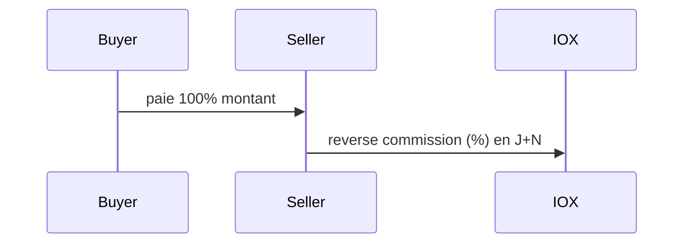
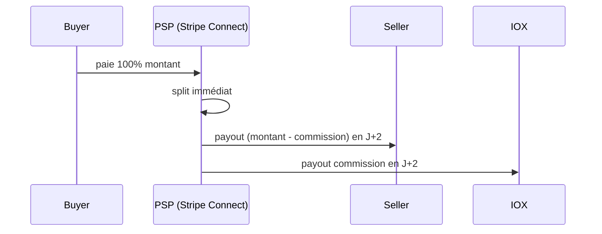
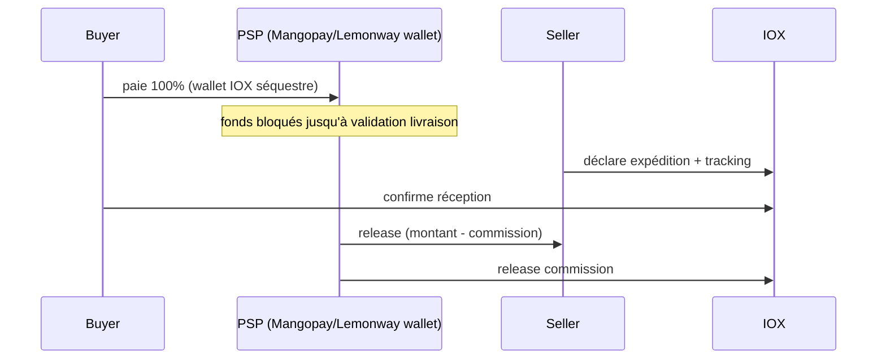
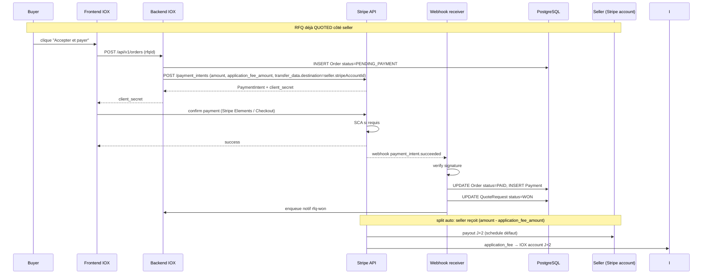
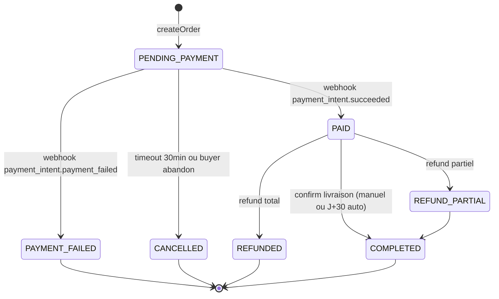
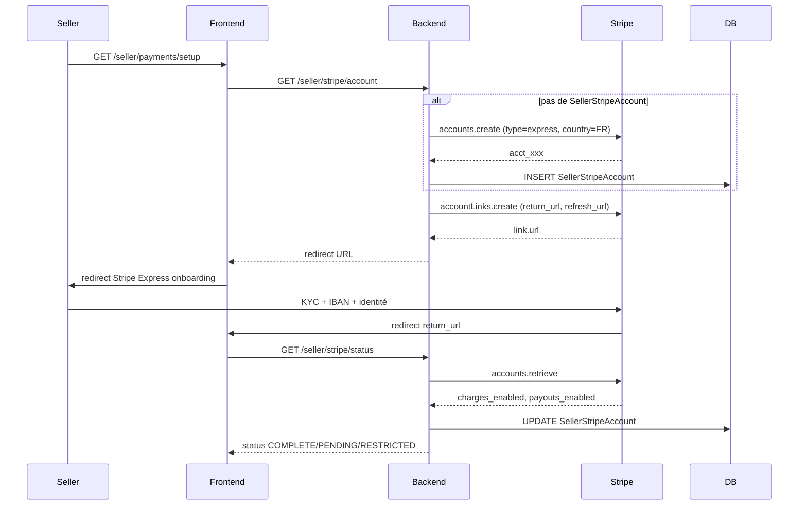

# PAY-1 phase 0 — Cadrage paiement marketplace IOX

**Statut** : draft cadrage, doc only, zéro code.
**Auteur** : équipe IOX.
**Date** : 2026-04-28.
**Décision attendue** : §9 (10 décisions à trancher avant phase 1).
**Sortie** : ce document + handoff vers PAY-1 phase 1 (POC Stripe Connect test mode).

---

## 1. Modèle économique

### 1.1 Flux de fonds — 3 options

#### Option A — Direct buyer→seller, IOX commission séparée



- Pour : simple, pas d'escrow, pas d'enjeu PSP marketplace.
- Contre : recouvrement commission risqué (seller peut ne pas payer), pas de tiers de confiance, dispute = bilatérale.
- Verdict : ❌ rejeté — pas de levier de récup commission, KYC seller pas centralisé.

#### Option B — Marketplace classique (split à la source)



- Pour : split automatique, KYC délégué PSP, dispute géré côté PSP.
- Contre : nécessite onboarding Stripe Connect par seller (Express account).
- Verdict : ✅ **reco** — standard marketplace BtoB.

#### Option C — Escrow (séquestre)



- Pour : protection acheteur forte, gestion litiges arbitrée IOX.
- Contre : IOX devient teneur de comptes (DSP2 lourd), complexité juridique, agrément ACPR potentiel.
- Verdict : ⚠️ **phase 3+** — sur-ingénierie pour V1, à reconsidérer si secteur vanille / litiges fréquents.

### 1.2 Modèle de commission

Quatre familles possibles :

| Modèle | Description | Pour | Contre |
|--------|-------------|------|--------|
| **% gross** | X% du montant TTC | simple, prévisible | impacte seller proportionnel |
| **% net + fee fixe** | X% + Y€ par transaction | couvre coût fixe PSP | complexe à expliquer |
| **Subscription seller** | abonnement mensuel + 0% transaction | revenu récurrent stable | barrière entrée seller |
| **Hybride** | % + minimum fee + plafond | équilibré | très complexe |

Reco V1 : **% gross simple**, taux à définir (3-8% typique BtoB marketplace agro).

### 1.3 Devises

- V1 : **EUR only** (90% buyers FR/UE).
- V2 (PAY-multi-devise) : USD pour buyers US, ZAR pour Afrique australe.
- Stripe Connect supporte multi-devise nativement, ajout V2 = config seller `defaultCurrency`.

---

## 2. Réglementaire

### 2.1 Cadre juridique applicable

| Réglementation | Périmètre | Applicable IOX? |
|----------------|-----------|-----------------|
| **DSP2** (UE 2015/2366) | services de paiement, SCA | oui — Mayotte = UE |
| **PSD2 SCA** | authentification forte | oui — pris en charge par PSP |
| **AMLD5** | lutte blanchiment, KYC | oui — délégable PSP |
| **RGPD** | données personnelles | oui — déjà pris en compte |
| **LCEN** (FR) | commerce électronique | oui |
| **Code monétaire et financier** | EME, agent PSP | dépend modèle |

### 2.2 Statut IOX

Trois positions possibles :

#### Position 1 — Plateforme intermédiaire (reco V1)

IOX = **simple plateforme** facilitant la mise en relation. PSP régulé (Stripe) gère :
- collecte des fonds (Stripe = EME UK/IE agréé)
- KYC seller (Connect onboarding)
- payouts
- conformité DSP2 + AMLD5

→ **Aucun agrément requis pour IOX**. Hébergement contractuel via PSP.

#### Position 2 — Agent PSP

IOX agit au nom d'un PSP régulé. Nécessite contrat agent + déclaration ACPR (FR) ou équivalent.
→ Lourd, pas justifié pour MVP.

#### Position 3 — Établissement de monnaie électronique (EME)

IOX émet wallets séquestres (Option 1.1.C escrow).
→ Agrément ACPR + capital min 350k€ + procédures lourdes. Hors scope V1/V2.

**Décision §9.1** : adopter **Position 1** (plateforme + Stripe Connect).

### 2.3 Obligations IOX en Position 1

- CGU/CGV claires (rôle de plateforme, pas vendeur, pas teneur de fonds).
- Politique de modération + résolution litiges.
- Mention légale rôle Stripe (acceptation Stripe Services Agreement par les sellers).
- Information acheteur : prix TTC, droit rétractation BtoB (souvent exclu mais à vérifier secteur agro).
- Facture IOX (commission) → mention TVA Mayotte (8.5% taux normal vs 20% métropole).

---

## 3. PSP — analyse comparative

### 3.1 Critères d'évaluation

1. Support marketplace BtoB (split automatique).
2. KYC seller délégué (onboarding rapide).
3. Mayotte/UE conformité DSP2.
4. Coût total (transaction + monthly + dev).
5. Maturité SDK + documentation.
6. Time-to-market (POC à prod).

### 3.2 Tableau comparatif

| Critère | Stripe Connect | Mangopay | Lemonway | Adyen for Platforms |
|---------|---------------|----------|----------|---------------------|
| Marketplace BtoB | ✅ Express + Custom | ✅ wallet-based | ✅ marketplace BtoB | ✅ enterprise |
| KYC délégué | ✅ Connect onboarding | ⚠️ KYB partiel | ✅ KYC API | ✅ Adyen KYC |
| UE/Mayotte | ✅ EME UK/IE | ✅ EME LU | ✅ EME FR | ✅ EME NL |
| Frais carte EU | 1.4% + 0.25€ | 1.8% + 0.18€ | sur devis (~1.5%) | enterprise (~1%) |
| Frais Connect | 0.25% + 0.25$ payout | inclus | inclus | inclus |
| SCA | ✅ auto | ✅ | ✅ | ✅ |
| SDK Node | ✅ excellent | ✅ correct | ⚠️ daté | ✅ correct |
| Doc | A+ | B+ | B | A |
| Tickets ouverts (SO/GitHub) | très actif | actif | peu | enterprise only |
| Setup compte test | <10 min | jours (KYB) | jours (KYB) | semaines (sales) |
| Webhook robuste | ✅ retry + signature | ✅ | ✅ | ✅ |
| Refund partiel API | ✅ | ✅ | ✅ | ✅ |
| Currency | 135+ | 30+ | 25+ | 150+ |
| BtoB virement (SEPA) | ✅ Stripe Bank Debit | ✅ wallet→IBAN | ✅ | ✅ |

### 3.3 Recommandation

**Stripe Connect Express accounts** :
1. Time-to-market le plus court (POC en 2-3 jours).
2. Coût aligné concurrence (1.4% + 0.25€ EU cards).
3. KYC seller délégué intégral.
4. Documentation et SDK Node.js premier de classe.
5. Compatible Mayotte (EU IBAN, EUR).
6. Tarif Connect (`0.25% + 0.25$ par payout`) absorbé via commission IOX.

**Risques Stripe** :
- Dépendance fournisseur unique (mitigation : abstraction `PaymentProvider` interface dès phase 1).
- Tarif EU cards baisse avec volume (négociable >100k€/mois).
- Exclusion certains secteurs (Stripe Restricted Businesses → vérifier vanille/épices = OK).

**Décision §9.2** : valider **Stripe Connect Express**.

---

## 4. Workflow paiement RFQ → Commande

### 4.1 Diagramme de séquence — happy path



### 4.2 États Order



### 4.3 Branchement RFQ existant

`QuoteRequestStatus` actuel : `NEW | QUALIFIED | QUOTED | NEGOTIATING | WON | LOST | CANCELLED`.

Transitions impactées par paiement :
- `QUOTED → WON` ne sera plus déclenché manuellement par seller. Désormais : webhook `payment_intent.succeeded` set `WON`.
- Buyer accepte devis → frontend appelle `POST /orders` qui :
  1. crée `Order` PENDING_PAYMENT
  2. génère `PaymentIntent` Stripe
  3. retourne `client_secret`

Le bouton "Marquer WON" côté seller dashboard disparaît (ou devient admin-only).

---

## 5. Modèles Prisma à ajouter (phase 1)

### 5.1 Nouveau enum

```prisma
enum OrderStatus {
  PENDING_PAYMENT
  PAID
  PAYMENT_FAILED
  CANCELLED
  REFUND_PARTIAL
  REFUNDED
  COMPLETED
}

enum PaymentProvider {
  STRIPE
}

enum PaymentStatus {
  REQUIRES_PAYMENT_METHOD
  REQUIRES_CONFIRMATION
  REQUIRES_ACTION
  PROCESSING
  SUCCEEDED
  CANCELED
}
```

### 5.2 Modèle `Order`

```prisma
model Order {
  id                  String              @id @default(uuid())
  quoteRequestId      String              @unique @map("quote_request_id")
  buyerCompanyId      String              @map("buyer_company_id")
  sellerProfileId     String              @map("seller_profile_id")
  marketplaceOfferId  String              @map("marketplace_offer_id")

  amount              Decimal             @db.Decimal(12, 2)
  currency            String              @default("EUR")
  applicationFee      Decimal             @map("application_fee") @db.Decimal(12, 2)

  status              OrderStatus         @default(PENDING_PAYMENT)

  createdAt           DateTime            @default(now()) @map("created_at")
  updatedAt           DateTime            @updatedAt @map("updated_at")
  paidAt              DateTime?           @map("paid_at")
  completedAt         DateTime?           @map("completed_at")

  quoteRequest        QuoteRequest        @relation(fields: [quoteRequestId], references: [id])
  buyerCompany        Company             @relation(fields: [buyerCompanyId], references: [id])
  sellerProfile       SellerProfile       @relation(fields: [sellerProfileId], references: [id])
  marketplaceOffer    MarketplaceOffer    @relation(fields: [marketplaceOfferId], references: [id])
  payments            Payment[]
  refunds             Refund[]

  @@index([buyerCompanyId, status])
  @@index([sellerProfileId, status])
  @@index([status, createdAt])
  @@map("orders")
}
```

### 5.3 Modèle `Payment`

```prisma
model Payment {
  id                    String          @id @default(uuid())
  orderId               String          @map("order_id")
  provider              PaymentProvider @default(STRIPE)
  providerIntentId      String          @unique @map("provider_intent_id") // Stripe pi_xxx
  providerChargeId      String?         @map("provider_charge_id")          // Stripe ch_xxx
  amount                Decimal         @db.Decimal(12, 2)
  currency              String
  applicationFee        Decimal         @map("application_fee") @db.Decimal(12, 2)
  status                PaymentStatus
  failureCode           String?         @map("failure_code")
  failureMessage        String?         @map("failure_message")
  rawJson               Json            @map("raw_json")                    // dump webhook complet
  createdAt             DateTime        @default(now()) @map("created_at")
  updatedAt             DateTime        @updatedAt @map("updated_at")
  paidAt                DateTime?       @map("paid_at")

  order                 Order           @relation(fields: [orderId], references: [id])

  @@index([orderId])
  @@index([providerIntentId])
  @@map("payments")
}
```

### 5.4 Modèle `Refund`

```prisma
model Refund {
  id                  String      @id @default(uuid())
  orderId             String      @map("order_id")
  paymentId           String      @map("payment_id")
  providerRefundId    String      @unique @map("provider_refund_id")
  amount              Decimal     @db.Decimal(12, 2)
  reason              String?
  status              String
  createdAt           DateTime    @default(now()) @map("created_at")

  order               Order       @relation(fields: [orderId], references: [id])

  @@index([orderId])
  @@map("refunds")
}
```

### 5.5 Modèle `SellerStripeAccount`

```prisma
model SellerStripeAccount {
  sellerProfileId     String          @id @map("seller_profile_id")
  stripeAccountId     String          @unique @map("stripe_account_id")
  onboardingStatus    String          @map("onboarding_status") // PENDING | COMPLETE | RESTRICTED
  payoutsEnabled      Boolean         @default(false) @map("payouts_enabled")
  chargesEnabled      Boolean         @default(false) @map("charges_enabled")
  detailsSubmitted    Boolean         @default(false) @map("details_submitted")
  defaultCurrency     String          @default("EUR") @map("default_currency")
  createdAt           DateTime        @default(now()) @map("created_at")
  updatedAt           DateTime        @updatedAt @map("updated_at")

  sellerProfile       SellerProfile   @relation(fields: [sellerProfileId], references: [id])

  @@map("seller_stripe_accounts")
}
```

### 5.6 Modèle `Payout` (optionnel V1, utile reporting)

```prisma
model Payout {
  id                  String          @id @default(uuid())
  sellerProfileId     String          @map("seller_profile_id")
  providerPayoutId    String          @unique @map("provider_payout_id")
  amount              Decimal         @db.Decimal(12, 2)
  currency            String
  status              String
  arrivalDate         DateTime?       @map("arrival_date")
  rawJson             Json            @map("raw_json")
  createdAt           DateTime        @default(now()) @map("created_at")

  sellerProfile       SellerProfile   @relation(fields: [sellerProfileId], references: [id])

  @@index([sellerProfileId, createdAt])
  @@map("payouts")
}
```

### 5.7 Migration estimée

- 1 migration additive `mp_pay_1_orders_payments_refunds` (5 tables + 3 enums).
- 0 modification table existante (juste relations Prisma sur `QuoteRequest`, `Company`, `SellerProfile`, `MarketplaceOffer`).
- Réversible : drop tables (aucune donnée legacy à reprendre en V1).

---

## 6. UX Seller

### 6.1 Onboarding Stripe Connect Express

Page dédiée `/seller/payments/setup` :



### 6.2 Dashboard payments seller

Page `/seller/payments` :
- Solde disponible (call `balance.retrieve`)
- Solde en attente (en cours de versement)
- Liste payouts récents (DB local + sync `payouts.list` Stripe)
- Liste orders avec statut paiement
- Bouton "Mettre à jour mes informations Stripe" (re-redirect onboarding link)

### 6.3 Restrictions seller V1

Seller ne peut publier offre `PUBLISHED` **que si** `SellerStripeAccount.payoutsEnabled = true`. Sinon :
- bouton publish désactivé
- bandeau "Configurez vos paiements pour publier vos offres"
- redirect onboarding setup

→ Workflow `MarketplaceOffersService.publish()` ajoute gate stripeOnboarded.

---

## 7. UX Buyer

### 7.1 Bouton "Accepter et payer"

Sur `/buyer/quote-requests/[id]` quand RFQ status = `QUOTED` :
- bouton remplace l'actuel form "Accepter".
- clic → POST `/api/v1/orders` → reçoit `client_secret` → ouvre Stripe Elements (modal) ou redirect Stripe Checkout (page hostée Stripe).

Reco V1 : **Stripe Checkout** (page hostée, plus simple, conformité PCI assurée par Stripe, mobile-friendly).

V2 : Stripe Elements embedded pour brand control.

### 7.2 Page `/buyer/orders`

Liste commandes du buyer connecté :
- colonnes : Offre, Seller, Montant, Status, Date paiement.
- click ligne → `/buyer/orders/[id]` détail.
- filtre status, période.

### 7.3 Détail `/buyer/orders/[id]`

- récap paiement (montant, date, Order ID).
- statut livraison (manuel V1, tracking V3+).
- lien vers RFQ d'origine.
- bouton "Demander remboursement" si éligible (PAID dernière 24h ou non livré).
- bouton télécharger facture (V2).

---

## 8. Sécurité

### 8.1 Webhook signature

```typescript
// PaymentsService.handleWebhook
const sig = req.headers['stripe-signature'];
const event = stripe.webhooks.constructEvent(
  req.rawBody, // RAW body, pas parsé JSON
  sig,
  process.env.STRIPE_WEBHOOK_SECRET,
);
// événements à gérer :
// payment_intent.succeeded
// payment_intent.payment_failed
// charge.refunded
// account.updated (seller onboarding status)
// payout.paid
```

→ Endpoint `POST /api/v1/payments/stripe/webhook` exempté JwtAuthGuard, body raw via `bodyParser.raw`.

### 8.2 Idempotence

- Header `Idempotency-Key` sur chaque appel `paymentIntents.create` côté backend (clé = `order:${orderId}`).
- Contrainte unique DB sur `Payment.providerIntentId` → un même PI ne peut produire deux `Payment`.
- Webhook reçu plusieurs fois → upsert sur `providerIntentId`.

### 8.3 PCI compliance

- IOX **ne stocke jamais de données carte** (PAN, CVV, expiration).
- Tokenisation 100% côté Stripe (Checkout ou Elements).
- IOX = SAQ-A (niveau le plus light) → questionnaire annuel uniquement.

### 8.4 Secrets

| Secret | Source | Rotation |
|--------|--------|----------|
| `STRIPE_SECRET_KEY` | Stripe Dashboard | trim. |
| `STRIPE_WEBHOOK_SECRET` | Stripe Dashboard endpoint | rotation à chaque update endpoint URL |
| `STRIPE_PUBLISHABLE_KEY` | frontend env build-time | jamais (public) |

Stockage : `.env` VPS, jamais dans repo. Variables exposées au frontend via `NEXT_PUBLIC_*`.

### 8.5 Logging

- Audit trail dans `Payment.rawJson` (dump webhook complet).
- `Order` audit via `AuditLog` (status changes).
- Pas de log de PAN/CVV (Stripe ne les expose pas → impossible).

### 8.6 Authentification SCA

- Stripe Checkout gère 3DS2 automatiquement.
- Buyer EU → SCA quasi-systématique sur cartes (Strong Customer Authentication DSP2).

---

## 9. Décisions à valider avant phase 1

| # | Décision | Reco | Statut |
|---|----------|------|--------|
| 9.1 | Statut juridique IOX | Plateforme intermédiaire (Position 1) | ☐ |
| 9.2 | PSP | Stripe Connect Express | ☐ |
| 9.3 | Modèle commission | % gross simple, taux à fixer (3-8%) | ☐ |
| 9.4 | Taux commission V1 | proposition : 5% | ☐ |
| 9.5 | Escrow ou direct? | Direct (Stripe split) — escrow phase 3+ | ☐ |
| 9.6 | Payout schedule seller | J+2 Stripe défaut | ☐ |
| 9.7 | Politique refund | Buyer demande → seller approuve OU IOX arbitre <24h auto | ☐ |
| 9.8 | Litiges/chargebacks | Stripe gère contestations, fonds bloqués jusqu'à résolution | ☐ |
| 9.9 | Multi-devise V1 | EUR only V1 | ☐ |
| 9.10 | Facturation IOX commission | Module factures dédié V2 (V1 = export CSV) | ☐ |

---

## 10. Découpage lots PAY-1+

### Lots prévus

| Lot | Description | Effort estimé |
|-----|-------------|---------------|
| **PAY-1 phase 0** | Cadrage (ce doc) | ✅ livré |
| **PAY-1 phase 1** | POC Stripe Connect test mode : 1 RFQ → 1 PaymentIntent → split → webhook OK. Pas d'UI, juste smoke script. | ~1j |
| **PAY-2** | Modèles Prisma + endpoints `POST /orders`, `POST /payments/stripe/webhook`, `POST /seller/stripe/account-link` + onboarding Stripe seller. | ~3j |
| **PAY-3** | UX buyer (bouton "Accepter et payer", page `/buyer/orders`) + UX seller (page `/seller/payments/setup`, dashboard `/seller/payments`). | ~3j |
| **PAY-4** | Refunds buyer + emails confirmation paiement + facture PDF | ~2j |
| **PAY-5** | Litiges/chargebacks UX admin + reconciliation comptable + monitoring (Stripe sync nightly) | ~3j |
| **PAY-multi-devise** | Support USD/ZAR + currency par seller | ~2j |

### Dépendances externes

- **Compte Stripe IOX** créé (test + live). Test peut démarrer immédiat. Live = activation après KYB IOX (siret, IBAN, RIB, contrat Stripe Services Agreement).
- **CGU/CGV** mises à jour (clause Stripe + rôle plateforme).
- **DPA** Stripe (Data Processing Agreement) signé.

### Critères de sortie phase 0

- [x] document cadrage rédigé (ce fichier)
- [ ] décisions §9 validées par sponsor produit
- [ ] compte Stripe test IOX créé
- [ ] handoff phase 1 (POC) ouvert dans backlog

---

## Annexes

### A.1 Glossaire

| Terme | Définition |
|-------|------------|
| **PSP** | Payment Service Provider (Stripe, Mangopay, etc.) |
| **EME** | Établissement de Monnaie Électronique (statut régulé ACPR/équivalent) |
| **DSP2** | Directive sur les Services de Paiement 2 (UE 2015/2366) |
| **SCA** | Strong Customer Authentication (3DS2) |
| **PCI DSS** | Payment Card Industry Data Security Standard |
| **SAQ-A** | Self-Assessment Questionnaire A (PCI niveau le plus light, marchands externalisant intégralement à un PSP certifié) |
| **KYC** | Know Your Customer (vérification identité) |
| **KYB** | Know Your Business (vérification entreprise) |
| **AML** | Anti-Money Laundering |
| **PaymentIntent** | objet Stripe représentant intention de paiement, lifecycle states |
| **Connect Express** | type compte Stripe Connect avec onboarding hosted by Stripe |
| **Application fee** | commission marketplace prélevée par Stripe et reversée au compte plateforme |
| **Transfer/Split** | mécanisme Stripe Connect répartissant les fonds vers compte vendeur |

### A.2 Liens utiles

- [Stripe Connect docs](https://stripe.com/docs/connect)
- [Stripe Connect Express](https://stripe.com/docs/connect/express-accounts)
- [Stripe Application Fees](https://stripe.com/docs/connect/direct-charges#collect-fees)
- [Stripe Webhooks](https://stripe.com/docs/webhooks)
- [Stripe Restricted Businesses](https://stripe.com/restricted-businesses)
- [DSP2 résumé Banque de France](https://acpr.banque-france.fr/)

### A.3 Risques identifiés

| Risque | Probabilité | Impact | Mitigation |
|--------|------------|--------|------------|
| Stripe rejette KYB IOX (Mayotte) | faible | élevé | contact Stripe sales early (avant phase 1) |
| Seller refuse onboarding Stripe (KYB perçu trop intrusif) | moyen | moyen | pédagogie + preview ce qui sera demandé + support seller |
| Vanille/épices = Stripe restricted? | très faible | bloquant | vérification pre-phase 1 (cas d'agro listés OK chez Stripe) |
| Commission négociée trop bas couvre pas frais Stripe | faible | moyen | minimum fee absolu (ex 1€) + simulation P&L |
| Disputes/chargebacks fréquents | moyen | moyen | escrow V3 + better delivery tracking V2 |
| Volume trop faible pour rentabiliser Stripe Connect fees | moyen | moyen | seuil minimum publication (offre <X€?) |
| Volume trop élevé → renégocier tarif Stripe | bonne nouvelle | nul | trigger > 100k€/mois → AM Stripe |

### A.4 Hors scope phase 0

- Choix exact taux commission (proposition 5% mais à valider sponsor).
- Politique exacte refund/délai rétractation BtoB.
- Modèle facturation/comptabilité IOX (TVA Mayotte 8.5%, factures émises au seller).
- Plan de réconciliation comptable nightly job.
- Rapprochement bancaire IBAN IOX ↔ Stripe payouts.

---

**Fin cadrage PAY-1 phase 0.**

Prochaine étape : décisions §9 + ouverture POC PAY-1 phase 1.
